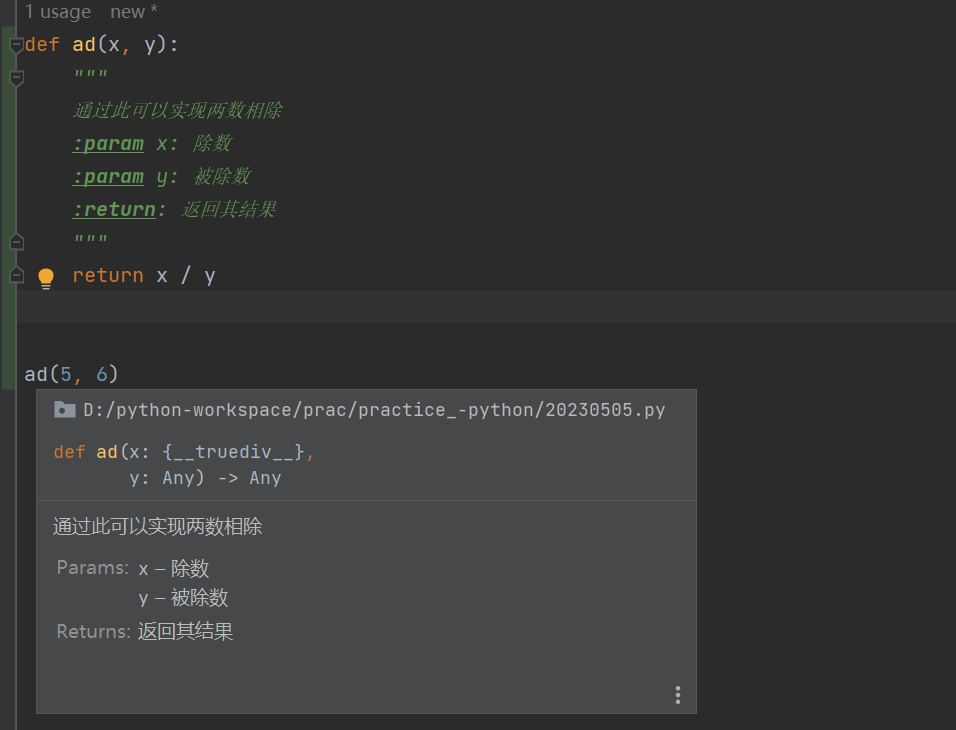
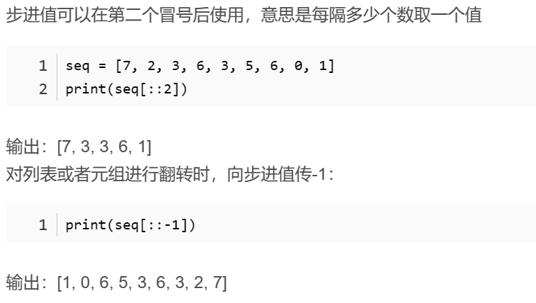
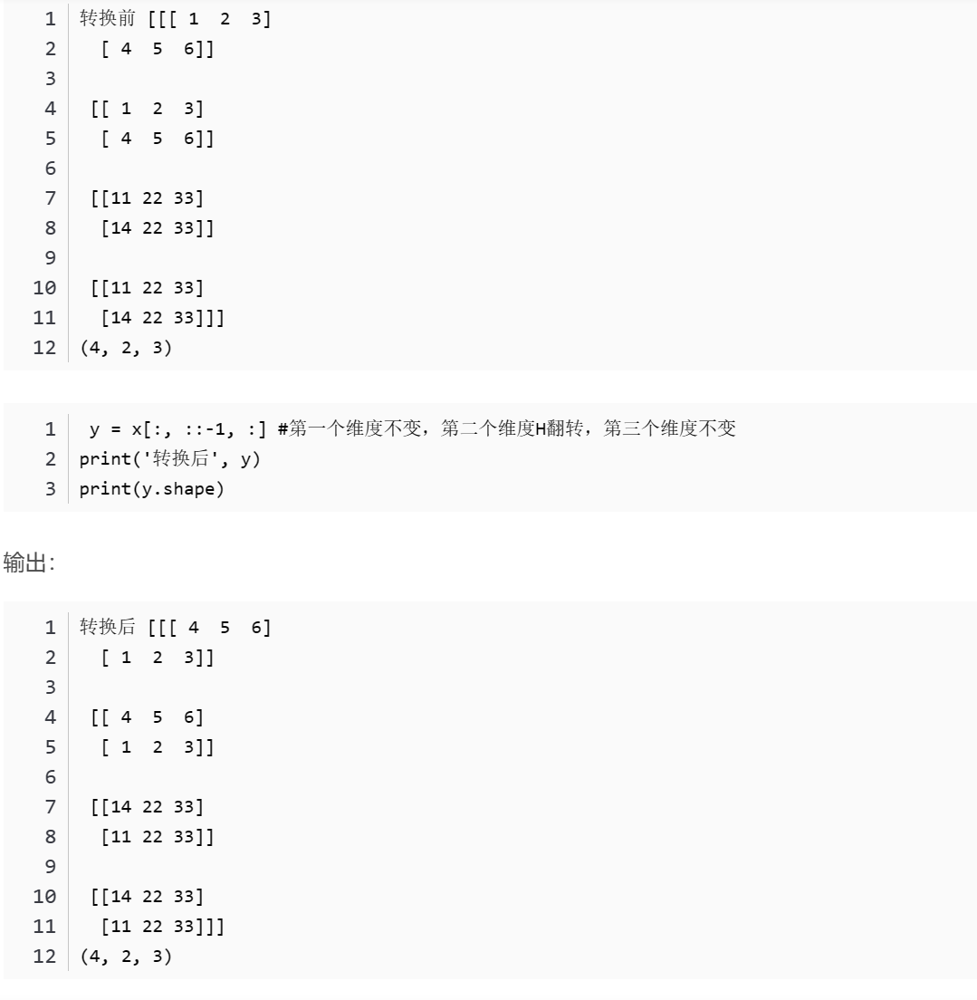
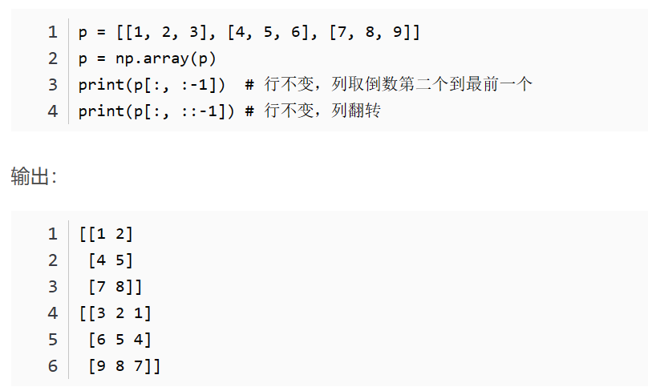
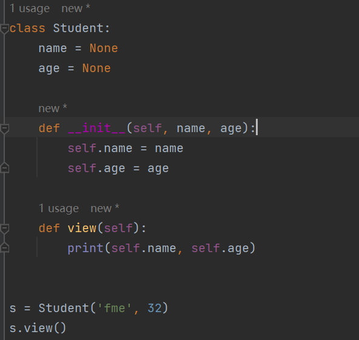
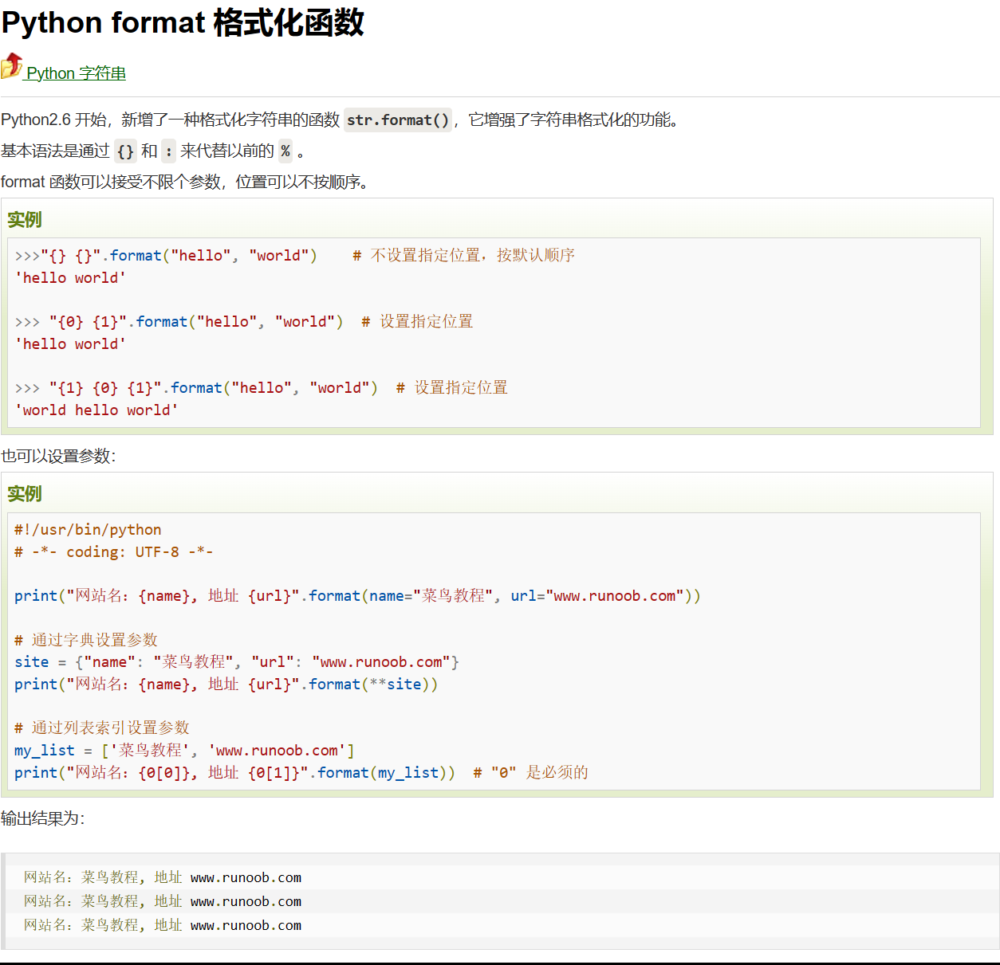
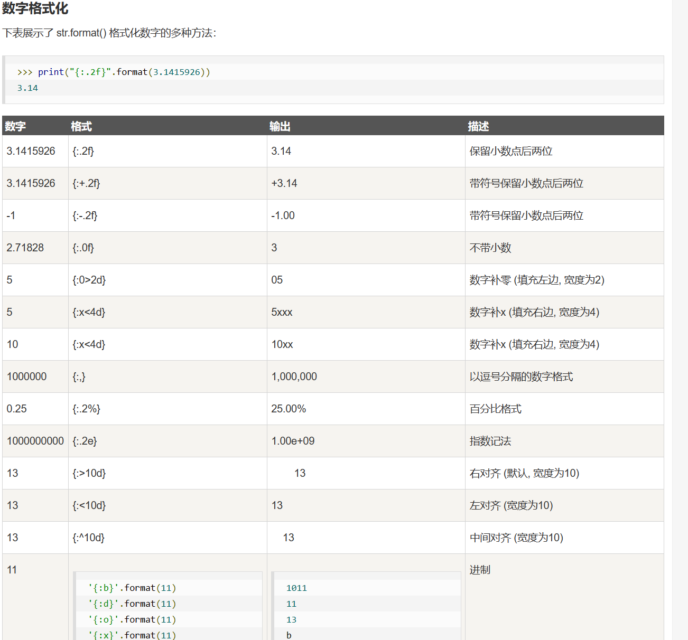

# 在本文档将记录python3再学习中所遇到的之前所不懂的问题与知识点，并记录每天的py文件内所完成内容

 - ## 2023/05/04
---
 - - python中变量不存在类型，只存在数据类型
 - - 从文件中读取的数字会默认为字符串，需要转换为数字类型
 - - float转到int会舍掉小数
 - ---
 - ### 命名规范
 - - 标识符命名只可以出现：英文、中文、数字、下划线，且只有**数字**不能作为开头
 - - 变量命名：对于两个单词以上组成的变量，需要用下划线_将其分隔开，且都要小写
---
 - - ~~~ python
     a = """abcd"""
     # 当前面有变量名接收时，三引号也作为字符串的表达
---
 - - 使用反斜杠[\\]可以消除后续字符的效用
 - - ~~~python
     a = '\'fmnfe\''
     # 'fmnfe'
---
 - ### 变量占位
 - - 通过使用%s在变量信息里面（引号内）占位，紧接着在同一行的引号外用%表明占位信息，多个占位需要用括号括起来
 - - %d占用为整数，%f占用为浮点数。
 - ~~~ python
     name = 'zhangyu'
     sex = 'male'
     bb = 'name: %s, sex: %s' % (name, sex)
     # name: zhangyu, sex: male
---
 - ### 快速格式化(字符串拼接)--不在乎类型，不会做精度控制
 - - 通过在引号前面设置f来对所有变量进行占位标记，变量通过{变量名}进行引入
 - - ~~~python
     print(f"我{num1},;{num2}")
     # 我11,;11.345
---
 - ### 精度控制
 - - [m.n]的模式,m作为全部位数控制（包括小数点），n作为小数部分位数控制，若原数字的位数比要求的m大，则不会有改动
 - - ~~~python
     num1 = 11
     num2 = 11.345
     print('%5d' % num1)
     print('%1d' % num1) 
     print('%7.2f' % num2) 
     print('%.2f' % num2)
     #   11
     #11
     #  11.35
     #11.35
---
 - ### range函数第二个参数是不会取到的
 - - ~~~python
     range(10)        # 从 0 开始到 9
     # [0, 1, 2, 3, 4, 5, 6, 7, 8, 9]
     range(1, 11)     # 从 1 开始到 10
     # [1, 2, 3, 4, 5, 6, 7, 8, 9, 10]
     range(0, 30, 5)  # 步长为 5
     # [0, 5, 10, 15, 20, 25]
     range(0, 10, 3)  # 步长为 3
     # [0, 3, 6, 9]
     range(0, -10, -1) # 负数
     # [0, -1, -2, -3, -4, -5, -6, -7, -8, -9]
     range(0)
     # []
     range(1, 0)
     # []
---

---
 - ## 2023/05/05
 - 在函数未定义返回值时，会自动返回None，其类型为NoneType
---
 - ### 函数说明文档
 - - 在定义函数时，需要注明其参数和返回值与函数作用，通过 “”“”“”+Enter 可以直接快速生成说明文档模板
 - 
---
 - ### 函数内定义变量需要通过添加golbal字段来进行修改全局

---
 - ### ***列表相关***
 - 1. ### 查询元素的序号
 - - list.index(元素)，若元素存在于列表中，将返回其下标序号.若不在，则报错，若有多个，则只返回第一个找到的下标序号
 - 2. ### 插入一批数据在列表尾部(追加)
 - - list.extend(数据容器)
 - - ~~~ python
     list = ['ekvr', 854, 'mendi', 854]
     list.extend([1, 4, 6])
     print(f'追加后的结果为{list}')
     # 追加后的结果为['ekvr', 854, 'mendi', 854, 1, 4, 6]
 - 3. ### 删除元素（依据下标）
 - - list.pop(下标)(常用)  || del list\[下标]
 - - ~~~python
     list = ['ekvr', 854, 'mendi', 854]
     del list[2]
     print(list)
     # ['ekvr', 854, 854]
     list = ['ekvr', 854, 'mendi', 854]
     sc = list.pop(2)
     print(f'删除的元素为{sc}，剩余列表结果为{list}')
     # 删除的元素为mendi，剩余列表结果为['ekvr', 854, 854]
 - 4. ### 删除元素（依据值）
 - - list.remove(值)————只会删除第一个遇到的该元素
 - 5. ### 获取某一个元素数量
 - - list.count(元素)
---
 - ### ***元组相关***
 - 1. 元组内的元素**不可以**被改变，但是若是可变类型\(list、dic、set)的数据，可以对其进行改变
 - - ~~~python
     tup = ('slfi', 9438, ['vfre', 'ijo'])
     tup[2][0] = 9843
     print(tup)
     # ('slfi', 9438, [9843, 'ijo'])
 - 2. 元组是可以进行组合的，通过+号进行组合
 - - ~~~python
     tup1 = (12, 34.56);tup2 = ('abc', 'xyz')
     tup3 = tup1 + tup2
     print (tup3)
     # (12, 34.56, 'abc', 'xyz')
---
 - ### 冒号在np中的含义
 - 1. ### 作为整体用于输出
 - - ~~~python 
     x = np.array([[1,2,3],[4,5,6]])
     print(x[0,:]) # 获取第0行全部元素
     print(x[:,0]) # 获取第1列全部元素
     # [1 2 3]
     # [1 4]
 - 2. ### 作为整体参与运算
 - - ~~~python
     a = np.arange(0,9) 
     print(a)
     print(a[2:-1]) # 获取该范围中的元素（有头无尾）
     print(a[-2:])
     print(a[:-2])
     # [0 1 2 3 4 5 6 7 8]
     # [2 3 4 5 6 7]
     # [7 8]
     # [0 1 2 3 4 5 6]
 - 3. ### 双冒号
 - - a[::n]，n代表着每n个数取一个数出来加入到结果中
 - 
 - 
 - 
---
 - ## 2023/05/05
 - - ### 字符串相关
 - 1. stipe方法————去除首尾空格与换行符（不带参时），去除首尾参数（带参数时）
 - - ~~~python
     str = '21fmeomom12 '
     print(str.strip())
     print(str.strip('21f6'))
     print(str.strip().strip('21f6'))
     # 21fmeomom12
     # meomom12 
     # meomom
---
 - - ### 集合
 - 1. 定义
 - - 对于空集合的定义是通过 my_set = set()如此进行定义的。集合中的元素，不会重复，即使定义时有重复，但最终只会显示一个
 - 2. 添加：my_set.add('')
 - 3. 去除：my_set.remove('')
 - 4. 取出：pop()方法
 - 5. 取差集：
 - - ~~~python
     set1 = {1,2,3}
     set2 = {6,5,1}
     print(set2.difference(set1))
     # {5, 6}
 - 6. 消除差集，通过set1.difference_update(set2)，即可消除set1中与set2有交集的部分
 - 7. 合并，set3 = set1.union(set2)
---
 - - ### sorted函数
 - - 对数据容器中的元素进行排序，并将排序后的结果丢到列表中
 - - ~~~python
     sorted(xx, reverse=[True/False])
---
 - ### 函数进阶
 - 1. 在定义时对参数使用默认值，需要将这个参数设置在所有参数的最后位置
 - 2. ### *args
 - - 通过在定义函数时使用args，在传参时，将更多的参数传到args变量中，并将其作为元组
 - - ~~~python
     def info(*args):
         for i in args:
             print(i, end=' ')
         return 0
     info('dwr',234,454,4654,'efr')
     # dwr 234 454 4654 efr 
 - 3. ### **kwargs
 - - 通过在定义时使用kwargs，将更多的键值对参数传到kwargs变量中，并将其作为字典
 - - ~~~ python
     def inin(**kwargs):
         for i in kwargs.keys():
             print(kwargs[i], end=' ')
         return 0
     inin(p=434,a=3435,o=3455,l=23423)
     # 434 3435 3455 23423 
 - 4. 函数也可作为参数传递
 - 5. ### 匿名函数lambda
 - 具体语法: lambda arguments: expression
 - - - lambda与filter结合:
 - - - filter其后有两个参数，第一个是函数，后一个是列表，其运作方式是将列表中的元素一个一个放进函数中进行匹配过滤，返回其中的结果为True的数
 - - ~~~python 
     import math
     new_list = list(filter(lambda x:math.sqrt(x) % 1 == 0, range(0,101)))
     print(new_list)
     # [0, 1, 4, 9, 16, 25, 36, 49, 64, 81, 100]
 - - - lambda与map结合：
 - - - filter其后有两个参数，第一个是函数，后一个是列表，其运作方式是将列表中的元素一个一个放进函数中进行映射返回
 - - ~~~python
     my_list = [1, 5, 4, 6, 8, 11, 3, 12]
     new_list = list(map(lambda x: x * 2 , my_list))
     # [2, 10, 8, 12, 16, 22, 6, 24]
---
 - ## 2023/05/07
 - - ### 异常（try/except/else/finally）
 - - 针对于except语句，其标准格式为：
 - - ~~~python
     except Exception as e:
 - - else是在未出现异常的情况下，会进行的操作
 - - finally是无论程序是否出现异常，都会执行的操作。
--- 
 - - ## main
 - - 在每个python文件中，都会内置一个名为__name__的变量，当运行此py文件时，会将其赋值为main，这就是main函数的运作方式。
 - - 同时在自定义module时，会自动运行其中的全局声明，此时传递的__name__变量的赋值不为main
 - - 若在module内使用了 __all__ = ['自定义函数名'，···]，则使用from module import *时，其他未在\[]内的函数则不能直接被引用，需要自行import
---
 - - ## 打开文件
 - - 打开文件需要首先在try前写明 f = None ，以防出现文件不存在导致报错，同时在finally里进行f == True 的判断再f.close
---
 - ## 2023/05/08
 - - ### json
 - - json转字符串：json.dumps(data)
 - - 列表、字符串等转json：json.loads(data)
---
 - - ### 面向对象
 - - ~~~python
     class student: # 设计类
         name = None
         gender = None
     stu_1 = student() # 创建对象
     stu_1.name = 'qweqw' # 对象属性赋值
     stu_1.gender = 'fd' # 对象属性赋值
     print(stu_1.gender)
     # fd
 - - 定义在类内部的函数称之为方法
 - ## 2023/05/09
 - - __init__方法（构造方法）：在创建类对象的时候会自动执行，将传入的参数自动传递给__init__方法使用
 - - 
 - - ### 私有成员（私有成员变量、私有成员方法）————变量名前面添加__
 - - 不可直接进行访问，但可以在类内部方法中使用
 - ## 2023/05/10
 - - ### 继承:
 - - 是一个类，继承另外一个或多个类的成员变量和成员方法
 - - ~~~ python
     class Phone: # 父类
        ...
        pass
     class Phone5g(Phone): # 子类
        pass
     # Phone5g类便可以使用Phone类中的变量与方法
---
 - - ### 复写
 - - 在子类中重新声明父类的方法或者变量（同名）
 - - 若想在子类中调用被复写前的父类成员，通过以下实现：
 - - ~~~python
     父类.变量
     父类.方法(self)
     super().方法
---
 - - ### 类型注解
 - - ~~~python
     # 对变量做类型注解
     my_li: list[int] = [1, 2, 3]
     my_dic: dict[str, int] = {'edfe': 324}
     
     # 对形参进行类型注解
     def add(x:int,y:int): 
        pass
     
     # 对返回值进行类型注解
     def add(x:int,y:int) -> int: 
        return x+y
     
     # 联合类型注解
     my_dict:dict[str,Union[str,int]] # 此时表明my_dict字典的键为str，值可以是str或是int任意
---
 - - ## 多态
---
 - - ## format
 - 
 - 
---
 - ## 2023/05/11--开始机器学习基础
 - - ### matplotlib
 - - plt一些基本操作
 - - ~~~python 
     plt.figure(figuresize)
---
 - ## 2023/05/18 对自己表示严厉的批评，因为打篮球吃萝卜了而后出去玩竟然有一个周没学习！
 - - ### plotly是很优秀的一个图片框架库，画图可以找plotly内的进行使用调整
---
 - ### numpy
 - - ### arr.astype(int/float/...)
 - - 让ndarray内的元素的格式统一调整为括号内格式
 - - 可以在创建数组的时候便指定其类型:
 - - ~~~python
     a = np.array(range(0,10), dtype=float)
     print(a)
     # [0. 1. 2. 3. 4. 5. 6. 7. 8. 9.]
 - - ### np.round
 - - 取小数
 - - ### arr.flatten()
 - - 将多维数组展开成一维数组
 - - ### 取数操作
 - - ~~~ python
     arr[x] # 取某一行的所有元素
     arr[x:] # 取连续的多行
     arr[[x,y,z]] # 取不连续的多行
     arr[,x] # 取某一列的所有元素
     arr[,x:] # 取连续的多列
     arr[,[x,y,z]] # 取不连续的多列
 - - ### 更多索引方式
 - - ~~~ python
     1.布尔索引
     arr[x>10] = 10
     # 将arr中大于10的值都改为10
     arr = np.arange(0, 20).reshape(4, 5)
     print(arr < 10)
     # [[ True  True  True  True  True]
     #  [ True  True  True  True  True]
     #  [False False False False False]
     #  [False False False False False]]
     print(arr[arr<10])
     # [0 1 2 3 4 5 6 7 8 9]
     2.三元运算符
     np.where(arr<10,0,10)
     # 小于10则0，否则为10
     arr.clip(x,y)
     # 保留x-y的数，不足的替换为x或y（依据大小）

     
     
 - - ### 计算方面
 - 1. 数组与数字相加减乘除
 - - ~~~python
     t1 = np.arange(20).reshape(5,4)
     print(t1)
     #[[ 0  1  2  3]
     # [ 4  5  6  7]
     # [ 8  9 10 11]
     # [12 13 14 15]
     # [16 17 18 19]]
     print(t1 * 2)
     #[[ 0  2  4  6]
     # [ 8 10 12 14]
     # [16 18 20 22]
     # [24 26 28 30]
     # [32 34 36 38]]
 - - 在数组维度不同时，行或者列维数相同时，也可以进行计算
 - 2. 拼接
 - - ~~~ python
     np.vstack((arr1,arr2))
     # 垂直拼接
     np.hstack((arr1,arr2))
     # 水平拼接
 - 3. 行列交换
 - - ~~~ python
     arr[[x,y],:] = arr[[y,x],:]
     # 行交换
     arr[:,[x,y]] = arr[:,[y,x]]
     # 列交换
     
     
     